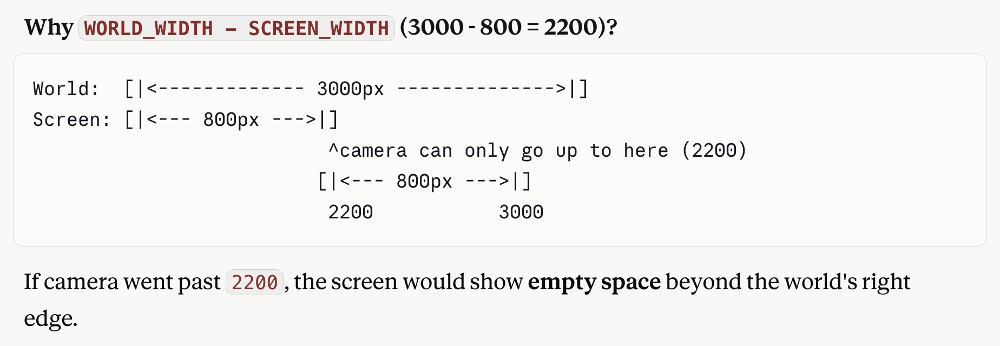

# Camera Calculation

main loop order
update_wave_system1. Input
2. Game State
3. Spawning
4. AI
5. Movement
6. Combat
7. Collision
8. Loot
9. Camera
10. Animation
11. Cleanup
12. Draw
while running:

    process_events()

    update_pause_system(game_state)

    if not game_state.paused:

        update_wave_system(game_state)
        update_spawner_system(game_state)

        update_player_system(game_state)

        update_enemy_system(game_state)

        update_projectile_system(game_state)

        update_combat_system(game_state)

        update_collision_system(game_state)

        update_loot_system(game_state)

        update_score_system(game_state)

        update_life_system(game_state)

        update_continue_system(game_state)

        update_camera_system(game_state)

        update_animation_system(game_state)

        cleanup_system(game_state)

    main_draw(game_state)

    pygame.display.flip()

✓ Side scrolling world
✓ Camera
✓ Depth movement
✓ Multiple enemies
✓ Enemy AI
✓ Health system
✓ Player combos
✓ Enemy attacks
✓ Knockback
✓ Health bars
✓ Game Over

game/systems/
├── wave_system.py
├── combat_system.py
├── loot_system.py
├── inventory_system.py
└── projectile_system.py

Enemy flow
HP <= 0
↓
state = DEAD
↓
loot drops once
↓
corpse stays for 60 frames
↓
enemy removed

Add visual feedback for hitting enemy
Player hits enemy
↓
Small yellow/white hit spark appears
↓
Spark disappears after a few frames

Enemy kill score
Combo score
Boss bonus
Stage bonus
Total score

+100 normal enemy
+200 fast enemy
+300 heavy enemy
+2000 boss

Combo x2
Combo x3
Combo x4

TOP SCORE
SCORE
LIVES
STAGE

Enemy killed      -> score increases
Breakable object  -> score increases
Boss defeated     -> big bonus
HUD shows score

Combo Score Multiplier
Hit enemies quickly
↓
Combo increases
↓
Score multiplier increases
↓
Combo resets if player stops attacking
1st kill: +100
2-hit combo: +200
3-hit combo: +300
5-hit combo: +500

Milestone 32 — Grab & Throw System
goal:
Press L near enemy
↓
Grab enemy
↓
Press L again
↓
Throw enemy
↓
Thrown enemy damages other enemies

Milestone 33 — Knockdown & Get-Up System
Goal
Heavy hit / thrown enemy
↓
Enemy falls down
↓
Stays down briefly
↓
Gets up
↓
Returns to battle
Milestone 34 — Player Lives & Respawn System

If player has no weapon:
    auto pick weapon

If player has weapon:
    compare ground weapon damage vs current weapon damage

If ground weapon is stronger:
    drop current weapon
    pick up ground weapon

Otherwise:
    ignore ground weapon

Milestone 35 — Continue Screen / Coin System

Milestone 37 — Stage Clear Bonus Screen
Stage Clear
Time Bonus
Life Bonus
Score Bonus
Milestone 38 — Extra Life System
5000 points -> +1 life
20000 points -> +1 life
Reach score threshold
↓
Gain +1 life
↓
Show floating text / HUD message
↓
Next threshold increases

Milestone 39 — Continue Credits / Arcade Coin System
Credits: 3
Continue consumes credits
Milestone 40 — Enemy Wave Intro / Warning UI
WARNING!
BOSS APPROACHING!

Milestone 39 — Credits / Coin System
goal:
Credits: 3

Player dies with 0 lives
↓
Continue screen appears

Press C
↓
credits -= 1
lives = 3
resume

Credits = 0
↓
cannot continue

Milestone 40 — Boss Warning & Wave Intro UI
Walk right
↓
================
WARNING !!
================
BOSS APPROACHING
(screen pauses briefly)
↓
Boss enters

Player movement:
1. walk
2. run
->->quickly
<-<- quickly
Higher speed
Different animation
Can transition into run attack
3. jump
4. back jump: jump + opposite direction
5. jump down/ jump up : jump while moving in lane

Attack actions:
Run+Attack: Mustapha performs: flying kick, sliding strike: one of the signature attacks

Jump+Attack: performs: air kick, downward strike

Grab combo: grab+attack+attack+attack
Grab +attack: knee strike

knee attack
L near enemy      -> grab enemy
J while grabbing -> knee attack
J again          -> knee attack again
L while grabbing -> throw enemy

So do not force everything into bottom-center. Instead, make projectile/effect constructors clear and fix spawn positions.
Player/enemy/object/weapon/loot = bottom-center world position
Projectile/effect/floating text = point or top-left effect position

Let's use dynamic hurt box and hit box settings, based on configs of each movement/action loaded from player's animation config file.
And the hurt box and hit box offset_x, offset_y, width, height will be loaded for player's animation_config.py, since each frame might have different sizes, and each action might have different body movements and positions, so the hurt box and hit box for each move will be different. Also the offset_x and offset_y usually negative, since the offsets is relative to bottom center feet.

So basically all positions is relative to entity's bottom center feet

TODO:
for FPS=60, what is best practice for animations:
How many frames should use for idle, walk, running, jumping, fist attack, leg attach, grab and throw animations?
How to set Animation target FPS (how many animation frames per real second) how to Tune these to control perceived animation speed; values are in frames-per-second for player

How to find anchor point in player animation frames:
A good guideline is: pick the animation anchor by what is physically supporting or driving the body in that frame. Then set offset_x so that anchor pixel lands on player.x. For each frame, ask: What point on this pose should remain stable in world space?
Idle: 
anchor: midpoint between both feet
Walk: 
anchor: the foot currently carrying weight.For walk cycles, the planted foot changes over time.
left foot planted -> anchor left foot
right foot planted -> anchor right foot
both feet touching -> midpoint
But for a simple beat ’em up, you can also use the midpoint between feet for all walk frames. It is easier and often looks stable enough.
Run
Anchor: support foot during contact frames.
For airborne run frames, use pelvis/body center projected down to floor.

Punch / Standing Attack
Anchor: rear planted foot or midpoint under hips.
Usually best:
startup -> midpoint under hips
active punch -> rear planted foot
recovery -> midpoint under hips

Jump
Anchor: body center / hips, not feet, while airborne.
takeoff -> feet/floor contact
airborne -> pelvis center projected down
landing -> feet/floor contact
On takeoff and landing frames:
